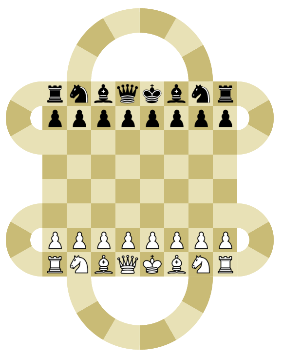
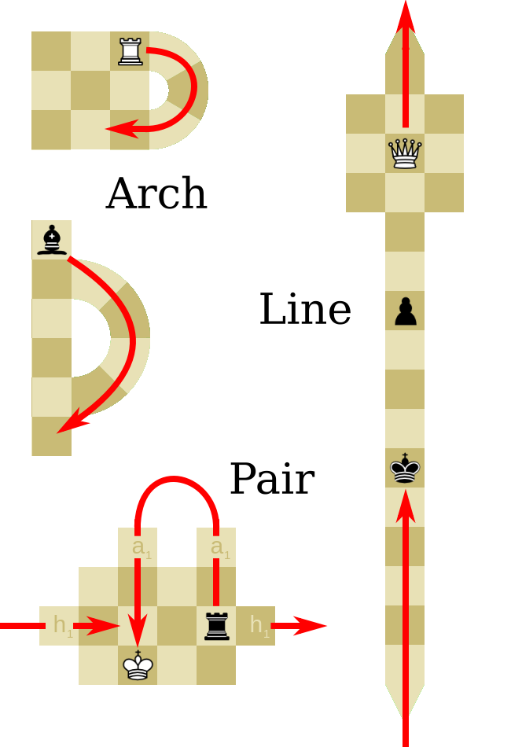

# HYPER-CHESS
Check it out: <https://hype-chess.web.app/>

Hyperchess is a platform for creating and playing non-Euclidean chess games. In this context, non-Euclidean refers to 'arches' connecting same sides of a board or 'lines' connecting opposite sides of a board. Users can play with their friends by sharing a link - games can be played on one of the preset boards (including cylindrical chess, toroidal chess etc.) or on user-created boards.

## Rules:
- No checks - take the King to win
- Auto-promote to Queen only
- Everything else (castling, *en passant*) as in regular chess
## Building:
'Square' places a normal square onto the board. 'Loop' lets you place either an 'Arch' or a 'Line' onto the board - the first click is the start square and the second click completes the loop. Placing a 'Pair' acts in the same way: a pair of arch squares or line squares may be placed - but no longer need to be on same or opposite sides of board (see the Mobius game board for an example of how this works).

Once finished, pressing 'Save' will save the board which can then be played on or edited later. Note pressing 'Save' whilst a playing a game will save the current state of the board - this can be used to save the boards of people you play against.
## Errata (AKA bugs I won't fix):
Pieces that move discretely (Pawn, Knight, King) cannot cross lines, but can move on arches assuming the shape roughly follows their move pattern.
Bishops approaching an arch at different angles exit the arch in different directions: approaching at an acute angle will cause a 'slingshot' which changes the y-direction of the move vector whereas an obtuse angle of approach will change the x-direction of the move vector. This is intended but feels counter-intuitive to some, and also leads to bishops being able to change colours.
A consequence of this angluar dependence (and hyper-square programming) means that a bishop or queen sitting on an arch can exit in *both* directions at *both* entrances. This is unintended but also quite fun - it leads to some more parity between Bishops and Rooks in terms of value but means Knights are now worth less.
The game can be zoomed in or rotated on mobile however zooming causes a slight performance slowdown/input lag which I can't pinpoint the reason for.
## Libraries
Thanks to the PeerJS team (<https://peerjs.com/>) for their library.
## Licensing
Licensed under the AGPL v3.
